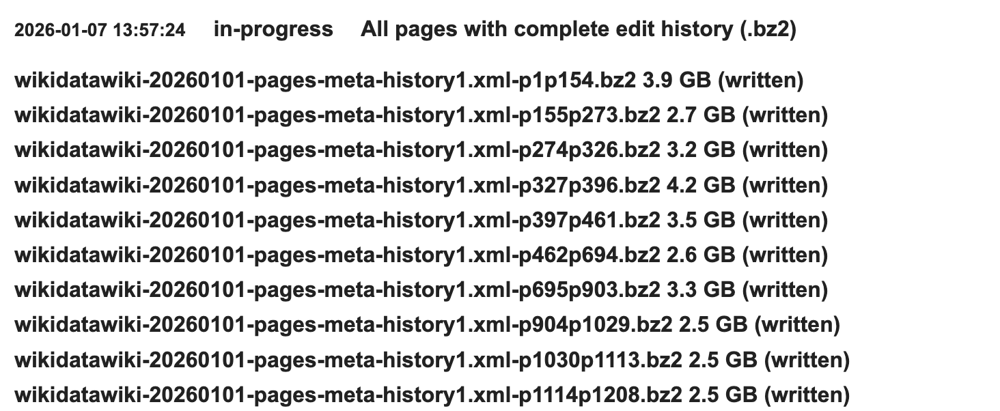
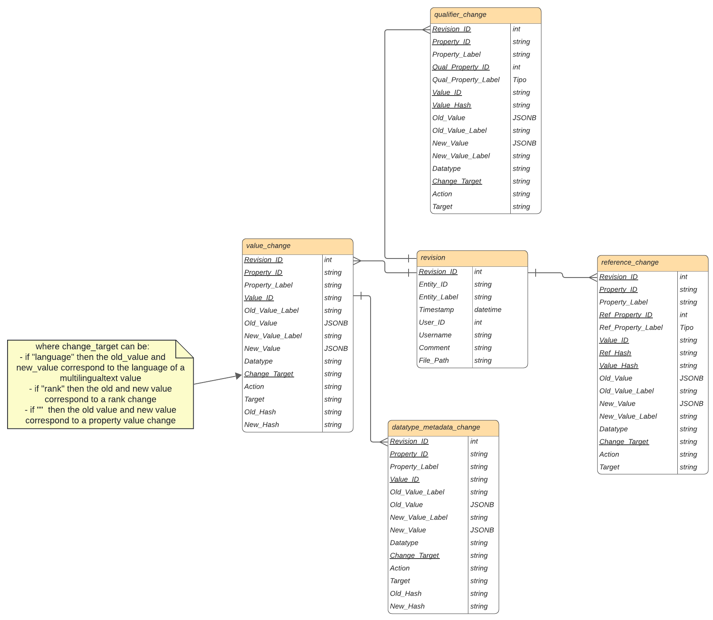

# WiDiff - Change Extraction and Classification in Wikidata

This tool extracts changes (diff between revisions) of statement values, ranks, qualifiers, and references, from Wikidata's xml dumps and stores them in a relational DB. For a description of the change extraction, refer to our paper [WiDiff: Change Extraction and Exploration in Wikidata]().

**For change classification see `wikidata-edit-history/README_classification.md`**.

This README is structured as follows:
- [Change extraction](#change-extraction): change extraction prerequisites and configuration parameters.
- [Running WiDiff](#running-widiff): explains how to run the extraction pipeline.
- [Databse schema](#database-schema): database schema description and diagram (includes change schema and feature tables).
- [Run metrics](#run-metrics): describes how to compute processing metrics from output files. 

**To reproduce the comparison of RDF and Relational DB storage go to *wikidata-edit-history/rdf_benchmarking/README.md*.**

## Project structure
```bash
├── config/           # Configuration files
├── auxiliary_data/           # Auxiliary datasets needed during parsing (subclassof_astronomical_objects.csv, subclassof_scholarly_articles.csv, transitive closure cache)
├── download_scripts/       # Script for downloading XML files + list of download links for the dump of 20250601
├── logs/       # Log folder with logs of change extraction
├── classifiers/ # contains rule, ml and llm classifiers
├── parser_scripts/        # Core parsing classes 
│   ├── file_parser.py              # Processes XML files, extracts pages
│   ├── page_parser.py              # Processes a page (all edit history for an entity)
│   ├── utils.py                    # Auxiliary methods 
│   ├── const.py                    # Constants
│   └── db_writer.py # in charge of storing changes in the DB
├── table_schemas/        # stores .sql schema of DB
└── wdtk/           # Files needed to extract extra data from a WD full dump (uses WD Toolkit)
```

## Change Extraction

*Please read the instructions carefully since there are parameters to be set (in set_up.yml) for running the extraction pipeline.*

### Prerequisites

- Python 3.11.9
- Install required libraries listed in `requirements.txt`.
- Update the following files:
    - data/subclassof_astronomical_objects.csv
    - data/subclassof_scholarly_articles.csv
    - data/property_labels.csv
using the queries in `data/sparql_queries.txt` against [Wikidata's query service](https://query.wikidata.org/), or [QLever](https://qlever.dev/wikidata/)
- Download dump files from Wikidata's dump service. The folder `download/` contains a script to download files from the list of files in `download/xml_download_links.txt`. Note that the list provided is from the dump of June 2025 which may not be available anymore, since Wikidata provides the more recent dumps ([Link to Wikidata dumps][https://dumps.wikimedia.org/wikidatawiki/]).
The files to download are the ones called pages-meta-history (See image below).



### Configuration (set_up.yml)

We provide a *set_up.example.yml* file. Copy this file and modify accordingly.

#### `database_config_path`
Path to the database configuration file, which has to be a json file with the following structure:

```
{
    "DB_USER": DB_USER,
    "DB_PASS": DB_PASS,
    "DB_NAME": DB_NAME,
    "DB_PORT": DB_PORT,
    "DB_HOST": DB_HOST
}
```

We provide a template file in *config/db_config.example.json*.

**NOTE: The DB needs to be created beforehand and the adequate credentials (username, user password, database name, hostname and port) need to be set on *the config/db_config.json* file. The schema is created by the pipeline.**

#### `change_extraction_processing`
Controls how the change extraction pipeline runs.

| Parameter | Description |
|---|---|
| *language* | Language code for extracting labels and descriptions (e.g., *en*) |
| *files_in_parallel* | Number of dump files processed in parallel |
| *pages_in_parallel* | Number of pages processed in parallel within a file |
| *files_directory* | Path to the directory containing the Wikidata dump files (xml.bz2) |
| *memory_consumption_monitoring* | If *true*, logs memory usage during processing |
| *page_queue_size* | Maximum number of pages held in the queue of *file_parser.py* |
| *db_batch_size* | Number of revisions inserted per database batch |
| *db_max_queue_size* | Maximum number of elems held in the queue of *db_writer.py* |

**NOTE: Provide the correct path to the directory storing the dump files (xml.bz2 format) in *files_directory***

#### `change_extraction_filters`
Controls which entity types are extracted and processed. Each filter has the following fields:

| Field | Description |
|---|---|
| *extract* | If *true*, changes for this entity type are extracted |
| *feature_extraction* | If *true*, ML features for change classification are computed for this entity type |
| *datatype_metadata_extraction* | If *true*, datatype metadata changes are extracted |

Available filters:

- **scholarly_articles_filter**: Entities classified as scholarly articles (Q13442814)
- **astronomical_objects_filter**: Entities classified as astronomical objects (Q6999)
- **less_filter**: Entities with fewer than *threshold* changes — used to exclude low-activity entities. *threshold* can be set in *set_up.yml*
- **rest`**: All remaining entities not matched by the above filters. This entities are extracted by default.

#### `reverted_edit_tagging`
Controls revert edit tagging during change extraction.

| Parameter | Description |
|---|---|
| time_threshold_seconds | Maximum time window (in seconds) within which an edit can be considered reverted. Default is *2419200* (4 weeks) |

#### `re_interpretation`
If *true*, performs rule-based classification, tagging soft deletions, soft insertions, value updates (for updates between values of different data types), refinement/unrefinement/re-formatting/textual_change/property_value_update for time, quantity, globecoordinate, and text data types.

## Running WiDiff

Activate your Python environment with the dependencies from requirements.txt before running the script.

Run the parser with the following command:

```bash
python3 -m extract_changes [options]
```

**Options:**

`-f FILE`: Path to .xml.bz2 file to process (for single file processing).
`-n NUM_FILES`: maximum number of files to process on a run.

Alternatively, use the provided `run_parser.sh` script to process a maximum of `NUM_FILES` files (Activate environment with requirements.txt beforehand):

```bash
chmod +x run_parser.sh
./run_parser.sh <NUM_FILES> &
```

*Note:* `run_parser.sh` runs `extract_changes.py` with the configuration set in `setup.yml` until `NUM_FILES` files have been processed.

### Parallelization
By default, extract_changes.py uses the following parallelization strategy:
- Creates *files_in_parallel* processes (from set_up.yml) that call FileParser (*file_parser.py*)
- Each FileParser creates *pages_in_parallel* processes (from set_up.yml) to call PageParser (*page_parser.py*) which processes a page (all revisions for an entity).
- Each file also gets its dedicated process for storing changes into the DB (*db_writer.py*)

The system must support at least *files_in_parallel* × *pages_in_parallel* + *files_in_parallel* (for the *db_writer*) cores.

Additionally, `file_parser.py` uses `pbzip2`, therefore, appropriate amount of memory needs to be reserved for processing files. 


---

### Output Files
The pipeline generates three output files:

- `processed_files.txt`: List of processed files (for tracking)
- `parser_output.log`: Logs from file_parser, page_parser and db_writer
- `parser_log_files.json`: Summary with file size in MB, number of entities, number of processed revisions, avg. revisions per entity, time to read file (secs), total time to process file (secs), peak memory in MB (if `memory_consumption_monitoring: true` in set_up.yml)

--- 

## Database schema
The main schema is composed of the **change tables** (value, rank, qualifier, reference and data type metadata). Additionally, we also provide **entity_stats** tables which contain statistics (e.g., number of revisions, number or rank changes, etc.) per entity.

In the following we provide a reduced database schema diagram of the change tables.

The full schema for the tables can be found in *sql/change_schema.sql*, *sql/datatype_metadata_schema.sql*. 



### Datatype groupings
Since Wikidata defines 18 datatypes, some of which can have added "metadata" (e.g., a value of datatype quantity is accompanied by a unit, lower and upper bound), we group Wikidata's datatypes by their "JSON type" (See []()). For example, Wikidata's quantity datatype maps directly to a "JSON type" "quantity", while geo-shape maps to a "JSON type" "string". Therefore, we end up with the following datatypes: string, quantity, time, entity, globecoordinate.
We also include a new "datatype" named "unknown-values" for the values "somevalue" and "novalue".

In the following we show the groupings for "string" and "entity":
STRING_TYPES = ['string', 'external-id', 'url', 'commonsMedia', 'geo-shape', 'tabular-data', 'math', 'musical-notation']

ENTITY_TYPES = ['wikibase-item', 'wikibase-entityid', 'wikibase-property', 'wikibase-lexeme', 'wikibase-sense', 'wikibase-form', 'entity-schema']

### Change Tables

**`revision`** — one row per revision, storing metadata about each edit: the editor (user ID, username, type), timestamp, and a reference to the entity that was edited.

| Column | Description |
|---|---|
| prev_revision_id | ID of the previous revision |
| revision_id | ID of the revision |
| entity_id | ID of the entity |
| file_id | XML file name where this revision is stored |
| timestamp | Timestamp of the revision |
| user_id | ID of the user that made the edit |
| username | Username of the user that made the edit |
| user_type | User type. Can be "human" (for registered users), "bot" or "anonymous" |
| comment | Comment on the revision |
| q_id_redirect | Numeric part of the Q-id of the entity where the current entity is redirected to (e.g., if Q1 is redirected to Q123, then q_id_redirect holds the value 123) |

*Primary key:* revision_id

**`value_change`** — stores changes to statement values, including creations, deletions, and updates. Each row records the old and new value, the action performed, and whether the edit was reverted or is itself a reversion. The `change_target` field distinguishes between changes to the main value, a qualifier, the rank, or datatype metadata.

| Column | Description |
|---|---|
| revision_id | ID of the revision |
| property_id | ID of the property |
| value_id | ID of the property value |
| old_value | Old value of the property value |
| new_value | New value of the property value |
| old_datatype | Old datatype of the property value |
| new_datatype | New datatype of the property value |
| action | Indicates the action performed: CREATE, UPDATE or DELETE |
| timestamp | Timestamp of the revision |
| label | Label of change classification. Can contain the values: soft_insertion, soft_deletion, statement_insertion, statement_deletion, refinement, unrefinement, re_formatting, textual_change, property_value_update |
| entity_id | ID of the entity |
| is_reverted | 1 if the edit is reverted, 0 otherwise |
| reversion | 1 if the edit does a reversion, 0 otherwise |
| reversion_timestamp | Timestamp of the edit that does the reversion. This column holds a value only if is_reverted = 1, otherwise it's NULL |
| revision_id_reversion | revision_id of the edit that does the reversion. This column holds a value only if is_reverted = 1, otherwise it's NULL |
    
*Primary key:* (revision_id, property_id, value_id)

*Foreign key:* (revision_id) references revision(revision_id).

**`qualifier_change`** — stores additions and deletions of qualifier values. Since qualifiers lack unique identifiers, only CREATE and DELETE actions are tracked (no UPDATE). Values are identified by a hash of their content.

| Column | Description |
|---|---|
| revision_id | ID of the revision |
| property_id | ID of the property |
| value_id | ID of the property value |
| qual_property_id | ID of the reference property |
| value_hash | Hash computed from the property value. This hash + qual_property_id identify each statement value |
| old_value | Old value of the property value |
| new_value | New value of the property value |
| old_datatype | Old datatype of the property value |
| new_datatype | New datatype of the property value |
| action | Indicates the action performed: CREATE or DELETE |
| timestamp | Timestamp of the revision |
| label | Label of change classification. Can contain the values: qualifier_insertion, qualifier_deletion, soft_deletion |
| entity_id | ID of the entity |

*Primary key:* (revision_id, property_id, value_id, qual_property_id, value_hash)

*Foreign key:* (revision_id) references revision(revision_id).

*Note:* (revision_id, property_id, value_id) does not necessarily exist in value_change since a revision could involve only qualifier changes

**`reference_change`** — stores additions and deletions of reference values, following the same approach as `qualifier_change`. Each row is additionally identified by a reference hash (`ref_hash`), which identifies the reference group the value belongs to.

| Column | Description |
|---|---|
| revision_id | ID of the revision |
| property_id | ID of the property |
| value_id | ID of the property value |
| ref_property_id | ID of the reference property |
| ref_hash | Hash computed from all the statement values in the reference. Identifies the reference (a reference is composed of multiple property - values) |
| value_hash | Hash computed from the property value. This hash + ref_property_id identify each statement value inside the reference |
| old_value | Old value of the property value |
| new_value | New value of the property value |
| old_datatype | Old datatype of the property value |
| new_datatype | New datatype of the property value |
| action | Indicates the action performed: CREATE or DELETE |
| timestamp | Timestamp of the revision |
| label | Label of change classification. Can contain the values: reference_insertion, reference_deletion |
| entity_id | ID of the entity |

*Primary key:* (revision_id, property_id, value_id, ref_hash, ref_property_id, value_hash)

*Foreign key:* (revision_id) references revision(revision_id).

*Note:* (revision_id, property_id, value_id) does not necessarily exist in value_change since a revision could involve only reference changes

**`datatype_metadata_change`** — stores changes to datatype-specific metadata fields (e.g., `upperBound` for quantity values). These are tracked separately from the main value change.

| Column | Description |
|---|---|
| revision_id | ID of the revision |
| property_id | ID of the property |
| value_id | ID of the property value |
| old_value | Old value of the datatype metadata |
| new_value | New value of the datatype metadata (e.g., if the 'unit' for a quantity value changes from *square metre (Q25343)* to *metre (Q11573)*, then old_value will have *Q25343* and new_value will have *Q11573*) |
| old_datatype | Old datatype of the property value |
| new_datatype | New datatype of the property value |
| change_target | Name of datatype metadata (e.g. 'upperBound' for a quantity value) |
| action | Indicates the action performed: CREATE or DELETE |
| timestamp | Timestamp of the revision |
| label | Label of change classification. Can contain the values: context_update |
| entity_id | ID of the entity |

*Primary key:* (revision_id, property_id, value_id, change_target)

*Foreign key:* (revision_id) references revision(revision_id).

**`entity_stats`** — one row per entity, aggregating counts of all change types, user types, reverted edits, and processing times. Useful for entity-level analysis without querying the full change tables.

| Column | Description |
|---|---|
| entity_id | ID of the entity |
| entity_label | Entity label. Extracted as the last one. |
| entity_types_31 | List of Q-ids, corresponding to the last P31 values of the entity |
| entity_types_279 | List of Q-ids, corresponding to the last P279 values of the entity |
| num_revisions | Number of revisions |
| num_value_changes | Number of value changes (CREATE, DELETE, UPDATE) | 
| num_value_change_creates | Number of CREATE for property values changes |
| num_value_change_deletes | Number of DELETE for property values changes |
| num_value_change_updates | Number of UPDATE for property values changes |
| num_rank_changes | Number of rank changes (CREATE, DELETE, UPDATE) | 
| num_rank_creates | Number of CREATE for rank changes |
| num_rank_deletes | Number of DELETE for rank changes |
| num_rank_updates | Number of UPDATE for rank changes |
| num_qualifier_changes | Number of qualifier changes (CREATE, DELETE) | 
| num_reference_changes | Number of reference changes (CREATE, DELETE) |
| num_datatype_metadata_changes | Number of datatype metadata changes (CREATE, DELETE, UPDATE) | 
| num_datatype_metadata_creates | Number of CREATE for datatype metadata changes |
| num_datatype_metadata_deletes | Number of DELETE for datatype metadata changes |
| num_datatype_metadata_updates | Number of UPDATE for datatype metadata changes |
| first_revision_timestamp | First revision timestamp |
| last_revision_timestamp | First revision timestamp |
| num_bot_edits | Number of bot edits | 
| num_anonymous_edits | Number of anonymous edits |
| num_human_edits | Number of human (registered user) edits |
| num_reverted_edits | Number of reverted edit changes (CREATE, DELETE, UPDATE) | 
| num_reversions | Number of reversion changes (CREATE, DELETE, UPDATE) | 
| num_reverted_edits_create | Number of CREATE for reverted edit changes |
| num_reverted_edits_delete | Number of DELETE for reverted edit changes |
| num_reverted_edits_update | Number of UPDATE for reverted edit changes |
| file_path | file name where the edit history of the entity is stored |
| total_xml_parse_time_sec | Total time for reading the full page of the entity with all its edit history in seconds |
| total_process_time_sec | Total time for processing the full edit history of the entity in seconds |
| total_revision_diff_time_sec | Total time for calculating the diff between revisions in seconds |
| num_revisions_timed | Number of revisions for which the time for calculating the diff with a consecutive revision was measured |
| total_rev_edit_time_sec | Total time for reverted edit tagging |
| total_feature_creation_sec | Total time for feature creation in secons |
| num_feature_creations_timed | Number of feature creations calls for which the time was measured |
| total_rule_based_classification_sec | Total time for rule_based_classification_sec |

### Update Tables for Change Classification
One update table for the data types text and entity: `updates_text`, `updates_entity`
Each table stores the UPDATE changes that didn't get classified during rule-based classification, therefore, being classified with ML models.

For entity changes, the table contains all entity UPDATEs since classification depends on label and description of the entities and this is not provided by the edit-history files (we only get the QIDs from the snapshots).

**`updates_text`**
| Column | Description |
|---|---|
| revision_id | ID of the revision |
| property_id | ID of the property |
| property_label | label of the property |
| value_id | ID of the property value |
| old_value | Old value of the property value |
| new_value | New value of the property value |

*Primary key:* (revision_id, property_id, value_id)

*Foreign key:* (revision_id, property_id, value_id) references value_change(revision_id, property_id, value_id)

**`updates_entity`**
| Column | Description |
|---|---|
| revision_id | ID of the revision |
| property_id | ID of the property |
| property_label | label of the property |
| value_id | ID of the property value |
| old_value | Old value of the property value |
| new_value | New value of the property value |

| old_value_label | Label of the old_value |
| new_value_label | Label of the new_value |
| old_value_description | Description of the old_value |
| new_value_description | Description of the new_value |

*Primary key:* (revision_id, property_id, value_id)

*Foreign key:* (revision_id, property_id, value_id) references value_change(revision_id, property_id, value_id)

**Note:** All table names include a `{suffix}` placeholder, which is replaced at runtime for the different filters of entity types in `set_up.yml`. The values for this suffix can be: `_sa` (scholarly articles), `_ao` (astronomical objects), `_less` (entities with less than *threshold* value changes)

--- 

## Run metrics

See *metrics.ipynb* in *wikidata-edit-history/logs* for run metrics of the change extraction.

*run_results.csv* contains Elapsed time and MaxRSS for 100 files batch jobs ran to process the full June 2025 dump. 

*parser_log_files.csv* contains specs for the different filees in the dump.

